# Research_on_CUMCM_Question_C
本项目对2023全国数学建模C题的一二问进行研究，研究思路和方法根据赛后总结对原方法进行了改进。
#### 1 数据预处理与数据分析

##### 1.1 数据预处理


缺失值、异常值处理。

##### 1.2 数据分析

**时序分解**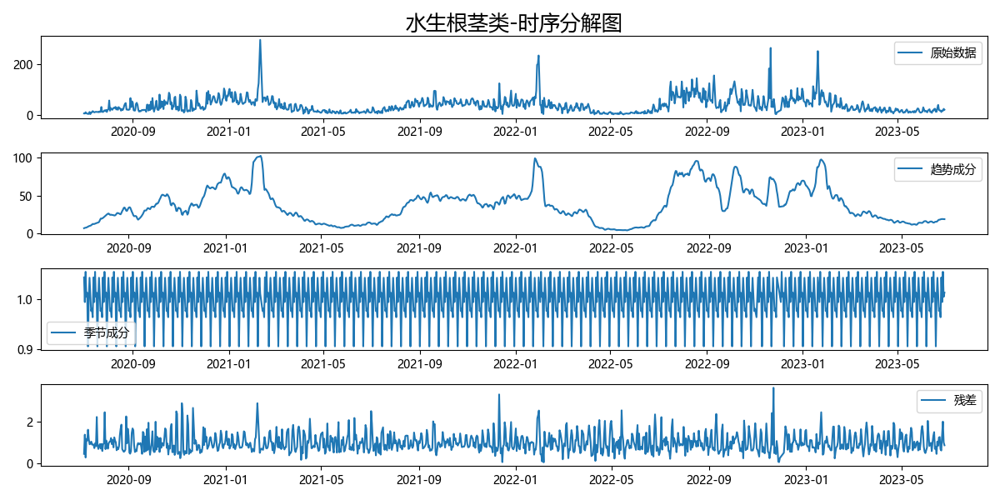

对各品类蔬菜的销量进行时序分解，我们发现销量是具有明显的季节特性。整体趋势并不明显，但是在特定时期会有较为明显的上升与下降，比如上图中趋势成分在每年的1月份左右会有一段上升，在大概2、3月份时又会恢复平稳，这可能与春节有关。

由于销量存在着较为明显的季节和假期效应，我们应该在后续的求解过程中应当考虑到这几个方面。

**对数分布拟合**

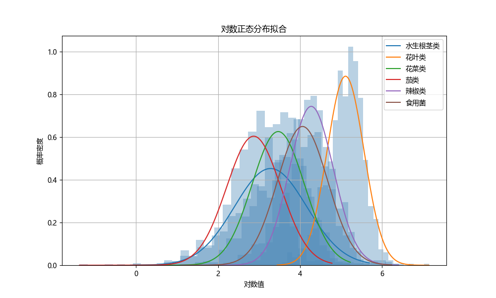

我们对各品类蔬菜的销量进行了对数分布拟合，如上图所示。水平来看，花叶类销量最高，说明其需求量大，畅销。茄类销量最低，说明其需求量较小。总体来看，各品类的销量是符合对数分布的，这有利于我们在后续求出结果后，对结果的合理性进行校验。

##### 1.2 数据分析

**ARIMA**
&emsp;&emsp; 
#### 2 最优定价与补货策略

##### 2.1 时序预测

**LSTM**


我们将时间步长设置为14。同时设置一个长度为15的滑动窗口对数据进行遍历，将前14条数据作为特征值，最后一条数据作为标签，以此来建立数据集，按照8:1:1划分训练集、验证集、测试集。模型参数如下图所示。

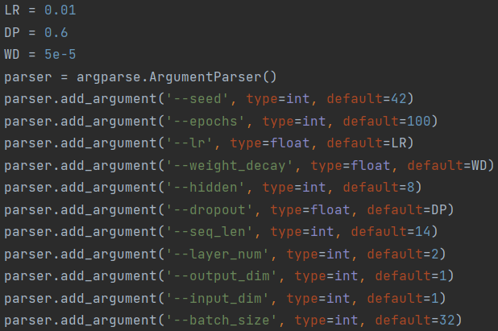

经过模型训练后，我们对未来一周的进价进行预测。我们滑动输入最后14天的数据至模型，得到结果。部分结果如下图所示。

<div align=center>
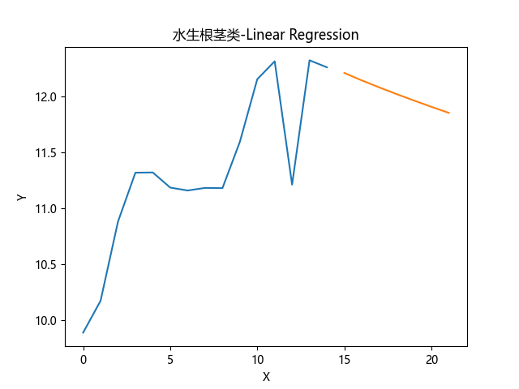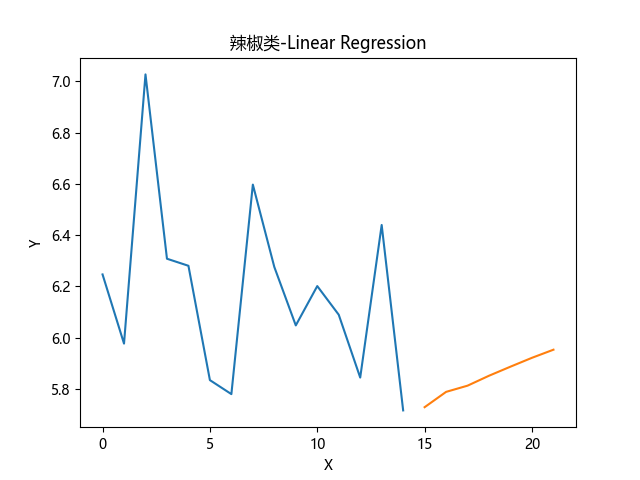
</div>


但是，我们发现LSTM存在严重的过拟合问题，且用来训练的数据集比较小。所以我们后续又使用了Prophet。

**Prophet**

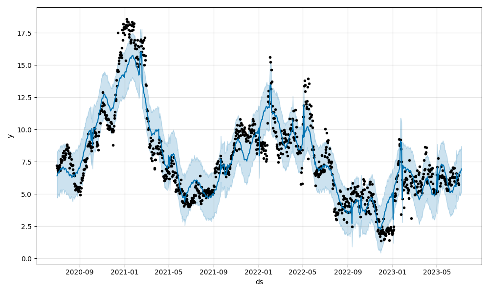

上图为辣椒类的Prophet拟合结果。R方值：0.8424063467517539；MAPE：16.44219104792144；RMSE：1.0324509776777813。拟合效果很好。我们对其未来一周的批发价格进行了预测，预测结果为：

```
6.700559181732566
6.66548621152141
6.623282135798618
6.784097018197269
6.819266796469724
6.939921397439264
```
##### 2.2 优化模型

加入需求弹性函数： $\ln S_{ij}=d+E_{p}\cdot\ln P_{ij}$ ，该公式通过弹性系数 $E_p=\frac{\Delta\mathrm{S}/S}{\Delta P/P}$ 推导得到。其中 $\Delta\mathrm{S}/S$ 表示需求的变化率， $\Delta\mathrm{P}/P$ 表示价格的变化率。

&emsp;&emsp; $E_p$ 和 $d$ 通过线性回归得到。对此，我们设置了一个滑动窗口 $[x-0.01,x+0.01]$ ， $x∈[min(ln(P)),max(ln(P))]$ 。对于在滑动窗口中的数据点，我们取它们的中位数来替代该数据点。这样做的原因在于我们发现在一个较小的邻域内，数据总是过于集中，且相差较大，这导致拟合的难度增加。考虑中位数的原因在于我们更希望采用真实的数据，而不是经过变换后的数据（如平均值）。下面两幅图是经过回归后的部分结果。
<div align=center>
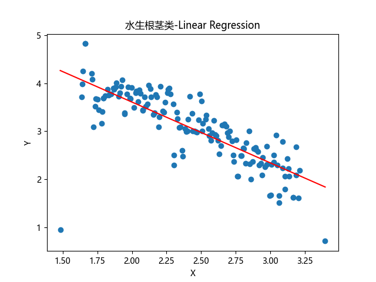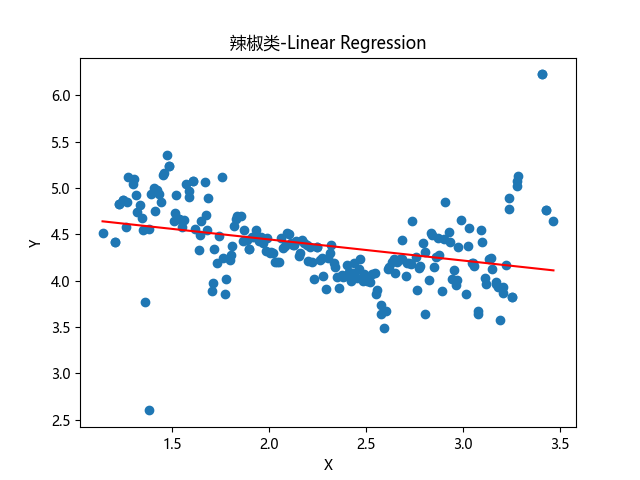
</div>
<div align=center>
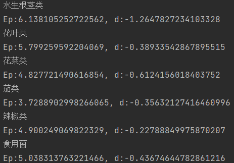
</div>


所有结果的 $E_p$ 均为负值，这反映了真实情况。说明当价格升高，销量会下降。但同时我们也发现，除了水生根茎类和花菜类，其他品类 $E_p<-0.5$，说明它们的销量更加稳定，是人们的必需品。

&emsp;&emsp;在此之后，我们可以建立优化模型，如下图所示。
<div align=center>
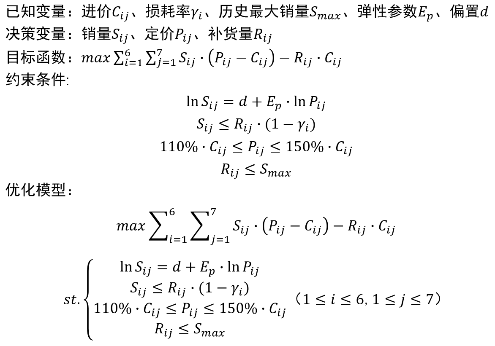
</div>

##### 2.3 模拟退火

&emsp;&emsp;经过模拟退火计算，我们得到了最优的定价和补货策略。退火过程和最优策略如下图所示。
<div align=center>
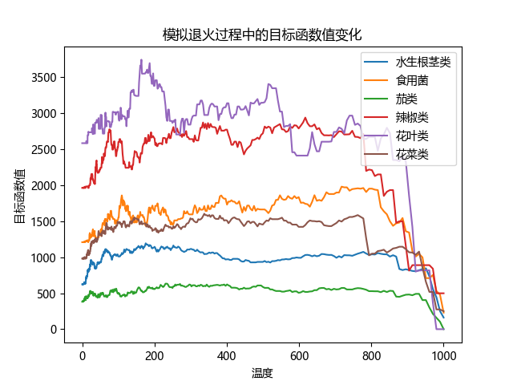
</div>


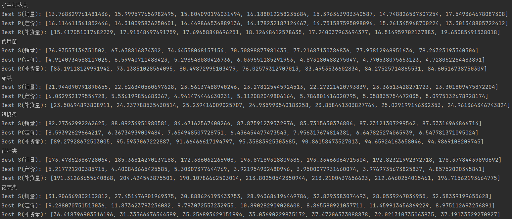

#### 3 结果校验

在数据分析中，我们对销量进行对数正态分布拟合。对于求解结果，我们发现其符合 $3σ$准则，说明求解结果较为准确。
